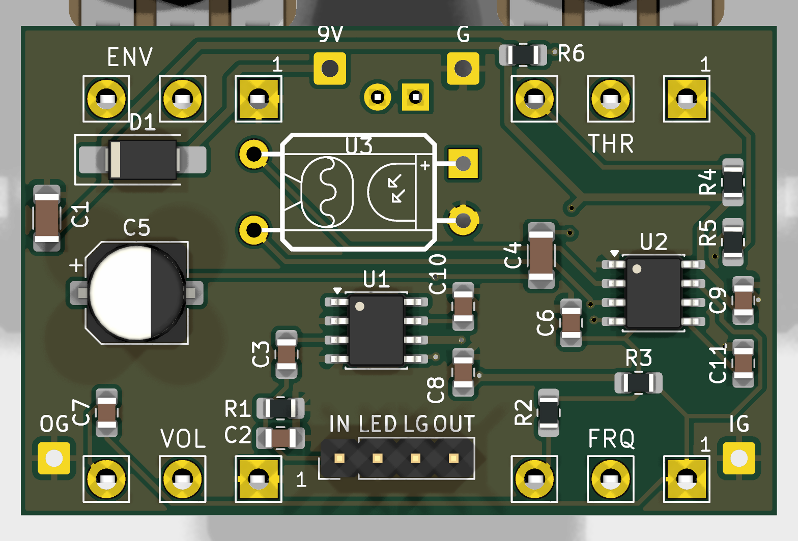

# Ugly Face 1 (SMD)

A gated, envelope-controlled square-wave synth fuzz for guitar, in a Hammond 1590B. LM386 + TLC555, SMD parts assembled by JLCPCB, panel parts hand-soldered.



## How it works

The guitar never reaches the output. You hear a **555 square-wave oscillator**, and the guitar controls it in three ways:

1. **Gate.** An LM386 at gain 200 turns the guitar into a clipped square, which drives the 555's RESET pin. The oscillator switches on and off every guitar cycle.
2. **Sync.** Each reset empties the timing capacitor, so the oscillator restarts in step with the note (hard sync).
3. **Pitch bend.** The LM386 output also lights a DIY vactrol (LED + LDR). Its LDR sits across the 555's timing resistor, so playing harder raises the pitch.

Full block-by-block explanation with the maths: [docs/Circuit Walkthrough.md](docs/Circuit%20Walkthrough.md). Schematic: [docs/UglyFace_01_schematic.pdf](docs/UglyFace_01_schematic.pdf).

## Controls

| Knob | Part | Function |
|---|---|---|
| ENV | RV1 B1k | Envelope: how much the playing level drives the vactrol (pitch bend) |
| THR | RV2 B10k | Threshold: 555 RESET bias. Gated / glitchy / always-on |
| FRQ | RV3 C100k | Oscillator frequency (measured ~125 Hz to ~8.3 kHz) |
| VOL | RV4 A100k | Output level |

## Build notes

- **SMD side** (top): assembled by JLCPCB (`production/` outputs are not in the repo; see Releases).
- **Hand-soldered:** four Alpha 16 mm pots and the 3 mm LED (D2) on the **back** (panel side); the DIY vactrol U3 (LED + LDR in heat-shrink); the 4-pin ribbon header J3 (IN, LED−, GND, OUT) to the footswitch board; wire pads 9V/G, IG, OG.
- D2: square pad = cathode (short leg).
- Power: 9 V centre-negative pedal supply; SS14 series reverse-polarity protection. Idle current ~6 mA (+~6 mA LED).

## Status

- v1.1 boards received from JLCPCB 2026-10-01; bench testing in progress. See [docs/Test Sheet.md](docs/Test%20Sheet.md) for measurements.
- Findings and ideas for v2: [docs/Build Notes.md](docs/Build%20Notes.md).

## Repository layout

```
UglyFace_01.kicad_pro / .kicad_sch / .kicad_pcb / .kicad_dru   KiCad 10 project
UglyFace.pretty/, UglyFace.kicad_sym, fp-lib-table, sym-lib-table  project libraries
3dmodels/        pot and enclosure models (referenced via ${KIPRJMOD})
docs/            walkthrough, test sheet, build notes, schematic PDF, renders
enclosure/       panel art (Affinity + PDF/SVG exports)
```

Opens with KiCad 10. All libraries and 3D models are project-local or from KiCad's standard library.
